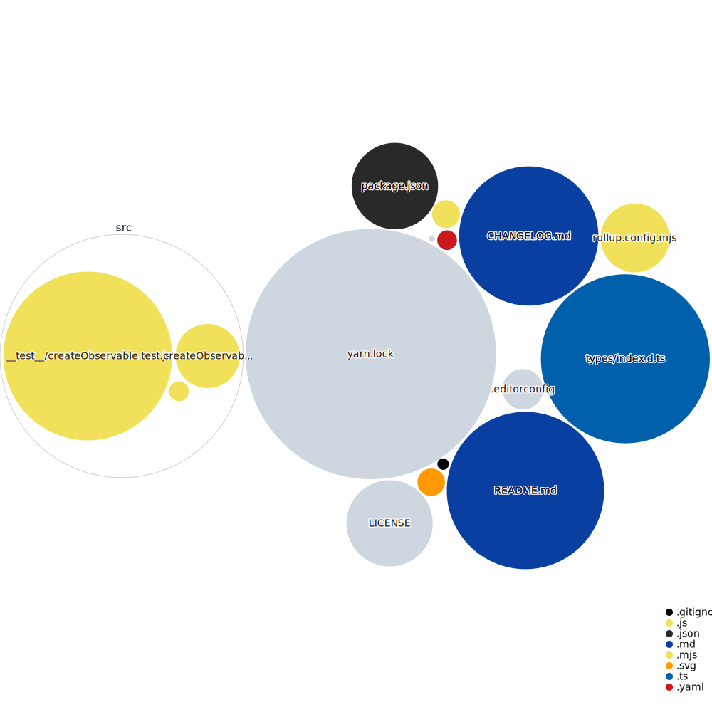

[](https://github.com/lukasduspiva/simple-observables/blob/master/LICENSE) [](https://www.npmjs.com/package/simple-observables) [](https://www.npmjs.com/package/simple-observables) [](https://github.com/lukasduspiva/simple-observables/issues)  

# Simple Observables 🔭

## Idea

**To have a simple JavaScript API for creating and using observable/subscription pattern**, without the need of importing super-heavy libraries such as [RxJS](https://github.com/ReactiveX/rxjs) (which I personally found to be one of the best libraries ever made).

## Getting Started

### Installation

Via `yarn`:

```cmd
yarn add simple-observables
```

Via `npm`:

```
npm install simple-observables
```

### Usage

ES modules:

```js
import { createObservable } from 'simple-observables';

const myObservable = createObservable();
```

## API `createObservable`

Creates an observable value and returns:

- getter - to get the current value
- setter - to set the current value
- subscribe - to subscribe an observer for value changes
- unsubscribe - to unsubscribe an observer for value changes

### Example

```js
const [getAnimal, setAnimal, subscribe, unsubscribe] = createObservable();

setAnimal('🐱');
console.log(getAnimal()); // 🐱

const logAnimal = (animal) => console.log(`My current animal is: ${animal}`);
subscribe(logAnimal);

setAnimal('🐶'); // My current animal is: 🐶
setAnimal('🐷'); // My current animal is: 🐷
setAnimal('🦊'); // My current animal is: 🦊

unsubscribe(logAnimal);
console.log(getAnimal()); // 🦊
```

### API Design

- **Array destructuring** is letting you name your variables:

```js
const [getValue, setValue, subscribe, unsubscribe] = createObservable();

const [getX, setX, subscribeToX, unsubscribeToX] = createObservable();
const [getY, setY, subscribeToY, unsubscribeToY] = createObservable();
// ...
```

- **Multiple subscriptions** support:

```js
const [getValue, setValue, subscribe, unsubscribe] = createObservable();

const logWithA = (value) => console.log(`A: ${value}`);
const logWithB = (value) => console.log(`B: ${value}`);
// ...

subscribe(logWithA);
subscribe(logWithB);
// ...

setValue('Hello!'); /* A: Hello!
                       B: Hello! */

unsubscribe(logWithA);
unsubscribe(logWithB);
// ...
```

- **Initial value** for observable can be provided:

```js
const initialValue = {
  preferredGreeting: 'Ahoj',
  profession: 'Pirate',
};

const [getValue] = createObservable(initialValue);

console.log(getValue()); // { preferredGreeting: "Ahoj", profession: "Pirate" }
```

- **TypeScript** support out of the box:

```ts
type Book = {
  name: string;
  author: string;
};

const doSomethingWithBook = (book?: Book) => {
  /* ... */
};

const bookObservable = createObservable<Book | undefined>(undefined);
const [getBook, setBook, subscribe, unsubscribe] = bookObservable;

subscribe(doSomethingWithBook);

setBook({
  name: 'The Metabarons',
  author: 'Alejandro Jodorowsky',
});

unsubscribe(doSomethingWithBook);
```

## Code in Repository


